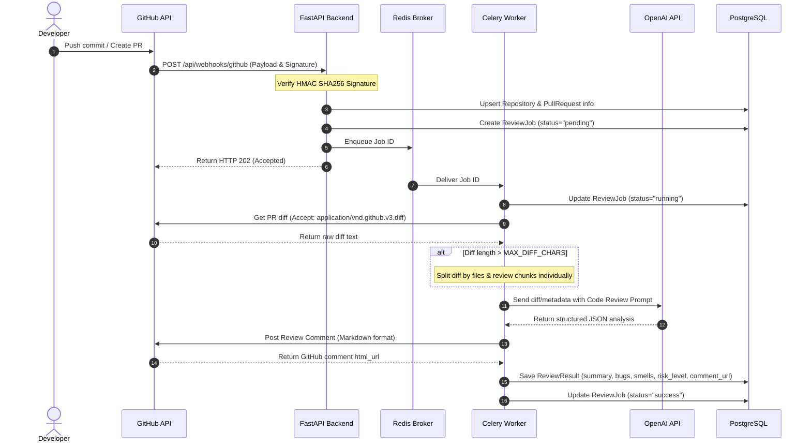

# Project Overview - AI GitHub Code Review Platform 📊🤖

Tài liệu này cung cấp cái nhìn chi tiết về thiết kế kiến trúc, vai trò của từng thành phần, luồng dữ liệu nội bộ và các định hướng tối ưu hóa mở rộng cho hệ thống **AI GitHub Code Review Platform**.

---

## 1. Mục Tiêu Dự Án
Mục tiêu cốt lõi của dự án là tự động hóa quy trình đánh giá mã nguồn (code review) của các lập trình viên ngay khi họ tạo Pull Request trên GitHub. Thay vì phải chờ đợi các kỹ sư cao cấp rà soát thủ công từng dòng code đơn giản, AI sẽ đóng vai trò như một người đánh giá đầu tiên (first responder), giúp:
- Phát hiện sớm các lỗi logic cơ bản, lỗi bảo mật nghiêm trọng (như SQL Injection, rò rỉ token/mật khẩu).
- Đề xuất các ca kiểm thử (test case) tương ứng để lập trình viên tự bổ sung.
- Tiết kiệm thời gian thảo luận trong nhóm phát triển, chuẩn hóa chất lượng code đầu ra.
- Lưu lại lịch sử đánh giá để làm tài liệu đào tạo và phân tích năng lực code của đội ngũ.

---

## 2. Các Thành Phần Hệ Thống

### 2.1. Backend (FastAPI)
Đóng vai trò là "Bộ não điều phối" (Orchestrator Interface):
- **FastAPI:** Lựa chọn nhờ tốc độ xử lý nhanh, hỗ trợ async IO mạnh mẽ, tự động sinh tài liệu Swagger/OpenAPI.
- **github_service.py:** Sử dụng `httpx` để giao tiếp trực tiếp với GitHub REST API. Việc này giúp giảm sự phụ thuộc vào các thư viện bọc bên ngoài vốn khó tuỳ biến.
- **core/security.py:** Thực hiện kiểm tra tính toàn vẹn của webhook bằng cách tính toán chữ ký HMAC-SHA256 trên thân request body, ngăn chặn các cuộc tấn công giả mạo payload.
- **db/session.py:** Quản lý kết nối cơ sở dữ liệu đồng bộ (Synchronous connection) giúp tương thích 100% với Celery Worker, tránh tình trạng rò rỉ kết nối (connection leak) hoặc xung đột bất đồng bộ.

### 2.2. Workers (Celery)
Đóng vai trò là "Lực lượng lao động" (Execution Unit):
- Thực hiện công việc nặng nhất: tải diff, gọi OpenAI API, phân tích logic, định dạng văn bản Markdown và gửi bình luận lên GitHub.
- Nhờ tách biệt khỏi Web Server, các tác vụ phân tích code tốn thời gian (từ 5 đến 30 giây) sẽ không làm nghẽn hoặc ngắt kết nối webhook từ GitHub.

### 2.3. Queue (Redis)
Đóng vai trò là "Hộp thư trung chuyển" (Message Broker):
- Sử dụng Redis làm hàng đợi tin nhắn tốc độ cao.
- Lưu trữ các job ID cần xử lý và trạng thái tạm thời của task. Nếu worker bị tắt đột ngột, Redis vẫn lưu giữ hàng đợi và sẽ xử lý tiếp ngay khi worker khởi động lại.

### 2.4. Database (PostgreSQL)
Đóng vai trò là "Trí nhớ dài hạn" (Persistence Layer):
- Lưu trữ 4 bảng thông tin cốt lõi:
  - `repositories`: Lưu thông tin các repo đã kích hoạt.
  - `pull_requests`: Lưu thông tin các PR và trạng thái đóng/mở.
  - `review_jobs`: Quản lý tiến trình phân tích (pending, running, success, failed) để Dashboard hiển thị trạng thái loading.
  - `review_results`: Lưu trữ chi tiết tất cả các phân tích lỗi bảo mật, bug, code smell dưới dạng trường JSON và điểm đánh giá rủi ro chung (LOW, MEDIUM, HIGH).

### 2.5. Frontend (React + Ant Design)
Đóng vai trò là "Giao diện quản trị" (Visualizer Panel):
- Thiết kế theo phong cách hiện đại với gam màu tối (Dark Mode), hiệu ứng bóng mờ (Glassmorphic Card) và font chữ Outfit cao cấp.
- Giúp quản lý toàn bộ các Repository đang hoạt động, tra cứu nhanh lịch sử review của từng PR, xem chi tiết từng lỗi logic được tô màu trực quan theo cấp độ rủi ro mà không cần mở GitHub.

---

## 3. Luồng Dữ Liệu Chi Tiết

---

## 4. Các Điểm Cần Lưu Ý Khi Mở Rộng (Scaling)

### 4.1. Vấn đề giới hạn Token & Giới hạn ký tự (Token Limits & Diff Splitting)
Đối với các Pull Request khổng lồ chứa hàng nghìn dòng thay đổi, việc đẩy toàn bộ mã nguồn vào prompt sẽ gây ra lỗi quá giới hạn ngữ cảnh (Context Limit) của mô hình hoặc vượt dung lượng payload cho phép của API.
- *Giải pháp hiện tại:* Platform tự động phát hiện độ dài diff thông qua biến cấu hình `MAX_DIFF_CHARS`. Khi vượt quá, hệ thống sẽ bóc tách diff theo từng file (`diff --git`), gửi review từng nhóm file nhỏ, sau đó gọi thêm một cuộc hội thoại OpenAI phụ để tổng hợp kết quả (synthesis) một cách thống nhất.
- *Cải tiến tương lai:* Lọc bỏ các file tự động sinh (auto-generated), các thư mục thư viện (như `node_modules`, `venv`, `yarn.lock`, `package-lock.json`) trước khi gửi lên AI.

### 4.2. Bảo mật mã nguồn (Source Code Privacy)
Khi gửi diff lên OpenAI công khai, mã nguồn của dự án có thể được dùng để huấn luyện mô hình (tuỳ thuộc vào chính sách bảo mật của tài khoản).
- *Giải pháp sản xuất:* Sử dụng gói dịch vụ doanh nghiệp của OpenAI (OpenAI Enterprise) để đảm bảo dữ liệu không bị lưu giữ làm tập huấn luyện, hoặc thay thế OpenAI client bằng các mô hình mã nguồn mở chạy nội bộ (như **Llama-3**, **Codellama**, **Mistral**) thông qua **Ollama** hoặc **vLLM** đặt sau mạng nội bộ công ty.

### 4.3. Đa luồng xử lý (Concurrency)
Khi hàng chục lập trình viên cùng commit đồng thời, số lượng tác vụ Celery sẽ tăng đột biến.
- *Giải pháp:* Tăng số lượng worker bằng cách scale-up số container `celery_worker` trong Docker Compose, đồng thời giới hạn số lượng tác vụ đồng thời của mỗi worker bằng cờ `-c 2` hoặc `-c 4` phù hợp với số nhân CPU của server.
